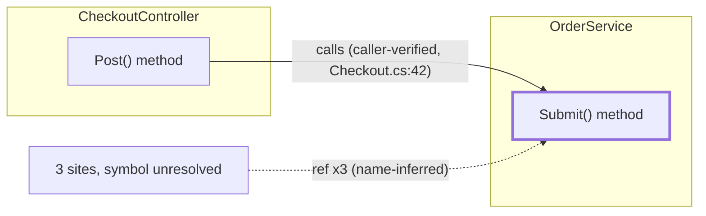

# AICodingServices Documentation — Graph Traversal Algorithm

> **Status:** scoped planning extension. UNREVIEWED. For operator review in the source tree.
>
> **Extends, does not replace:** [`docs/feature-maps/AICodingServicesDocumentation.md`](./AICodingServicesDocumentation.md). That feature map decides *what* to document, the folder-local `Docs/*.aim.md` shape, the `SourceDocEvidenceLevel` taxonomy, the safe-edit review workflow, manifest freshness, and the human/AI region split. **None of that is re-decided here.** This document adds the single missing layer the feature map calls out as a gap: the **graph-traversal algorithm** that computes the `Used By` and `Dataflow` sections and emits the mermaid diagram, plus the evidence-assignment rules that keep those computed claims honest.

---

## 1. Goal & fit

The feature map specifies the documentation *product* but leaves one named gap: there is no algorithm for computing `Used By` / consumer relationships, no dataflow edge-extraction rule, no diagram-emission rule, and no rule for assigning a `SourceDocEvidenceLevel` to a *computed* edge (as opposed to a read-from-source claim). This extension fills exactly that gap and nothing else.

**The spine — MCP augments the skill, one graph serves both consumers.** The `ArchitectureDiagramming` skill card, run against source alone (the documented eval condition: *"no live AICodingServices MCP tools visible; used docs/source/tests as evidence"*), can only ever justify `name-inferred` or `grep-backed` "who uses me" claims — reading a call site in text proves a *location*, not a resolved semantic edge. The contribution of this layer is to route that same focus through the **MCP-backed solution index** so each edge is **upgraded** from a text hit to a `caller-verified` (`call_sites` row) or `index-verified` (`symbol_references` / `symbol_relationships` row) claim. The skill card and the documentation engine are **two readers of one MCP-backed semantic graph**: the engine emits `*.aim.md`, the skill emits an architecture overview, and both read the *same* evidence labels off the *same* traversal so neither can silently out-claim its evidence. This matches the self-describing-projects vision (`docs/discussions/2026-06-05-stateless-engine-self-describing-projects.md`): the index is a *fresh projection*, the graph is rediscovered every run, and nothing is persisted in a parallel model.

---

## 2. Graph model

A typed multigraph `G = (N, E)`, built fresh per invocation from MCP, never stored. Every node and edge maps to a **real index/MSBuild row** — no invented data.

### Node altitudes

| Altitude | Source | Identity | Role |
|---|---|---|---|
| **A0 Project** | `list_watched_projects` plus scoped project/index metadata | `projects.stable_key` (MSBuild `StableProjectKey`) | `Folder.aim.md` project band + the cross-project context band of a focus diagram. |
| **A1 Document/file** | `query_solution_index(scope=file|folder|solution)` / `IndexedDocumentRow` | `FilePath` (carries `ContentHash`) | The node a per-file `SomeClass.aim.md` is written for; the freshness anchor. |
| **A2 Type** | `find_indexed_symbols`, `Kind = NamedType` | `StableKey` | Default focus node for "explain THIS code". |
| **A3 Member** | `find_indexed_symbols`, `Kind ∈ {Method, Property, Field, Event, Constructor}` | `StableKey`; `ContainingType` → A2, `FilePath` → A1 | Member-level `Used By` / `Key Methods`. |

The parent spine `A0 ⊃ A1 ⊃ A2 ⊃ A3` (from `ContainingType` / `FilePath` already on the symbol row — **no query**) is used only for clustering and for the **collapse operator** (§3.4). It is never rendered as a relationship claim.

### Edge kinds (each maps to exactly one query and carries an intrinsic evidence ceiling)

| Edge | Query / table | Direction stored | Evidence ceiling |
|---|---|---|---|
| **E_call** | `find_indexed_callers(targetKey)` → `call_sites` (`CallerStableKey`, `FilePath`, `Line`, `CallKind`) | inbound to target ("X calls me") | **CallerVerified** — only edge with an explicit, semantically resolved caller identity. |
| **E_ref** | `find_indexed_references(targetKey)` → `symbol_references` | inbound to target | **IndexVerified** when the left-join resolves a containing `Caller*`; **NameInferred** when `Caller*` empty (site real, consumer unresolved); target with empty `TargetName/Kind` is external → footnote. |
| **E_rel** | `find_indexed_relationships(key, direction, kind)` → `symbol_relationships` (7 kinds) | per-kind, see §4.2 — **INTRA-PROJECT ONLY** | **IndexVerified**. |
| **E_projref** | `list_watched_projects` / `project_references` | A0→A0, structural | **IndexVerified** (MSBuild fact). |
| **E_contains** | `ContainingType` / `FilePath` on the symbol row | A1⊃A2⊃A3 | clustering only — **never a relationship claim**. |

**The 7 relationship kinds** (`SolutionIndexStore.cs` `IsRelationshipKind`): `inherits_from`, `derived_type`, `implements_interface_member`, `implemented_by`, `overrides`, `overridden_by`, `partial_declaration`.

**Dataflow vs Used-By mapping.** `Used By` (inbound consumers) = `E_call ∪ E_ref` inbound, **plus** the *focus-is-provider* relationship kinds (§4.2). `Dataflow` (what the focus reaches / structurally is) = the *focus-is-consumer* relationship kinds **plus** outbound `E_call`/`E_ref` (see §6 for the outbound-query caveat). The index has **no parameter-type, field-type, or local-variable-type edge**, so "dataflow" is honestly limited to invocation / creation / reference / inheritance edges. Generic type-argument following is out of scope. **The design must not claim type-flow it cannot back.**

**Hard structural blind spot (disclose, never imply absence):** `symbol_relationships` is single-project-scoped. A base class or interface defined in *another* project yields **no** `E_rel`. Cross-project inheritance is structurally absent from the relationship table — it is never to be rendered as "no base type."

---

## 3. The algorithm

### 3.1 Recommended traversal — bounded bidirectional BFS over the semantic neighborhood

Recommended over a single whole-graph fold because per-file docs need a *focus neighborhood* (focus + context), not the whole solution. The project-altitude overview band (`Folder.aim.md`) uses the cheaper **fold** of §3.5; the per-file `Used By`/`Dataflow` sections use this BFS.

```text
CAPS (recommended defaults — operator-tunable, see §10):
  DEPTH_IN        = 2     # Used By rings
  DEPTH_OUT       = 1     # Dataflow rings
  FANOUT          = 12    # per node, rank-and-truncate, record overflow
  GLOBAL_NODE_CAP = 60    # file diagram   / 40 member diagram
  CALL_BUDGET     = 25    # MCP calls per focus diagram

INIT:
  focus      = resolve(focusSpec)        # find_indexed_symbols -> StableKey, or file -> its A2/A3 set
  G          = { nodes:{}, edges:{} }    # edge keyed (src,dst,kind) so duplicates dedupe
  frontierIn = [(focus,0)]; frontierOut = [(focus,0)]
  visitedIn  = {(focus)}; visitedOut = {(focus)}   # SEPARATE ring coloring
  calls = 0; overflow = {}; memo = {}    # memo caches per-key query rows (budget discipline)

VISIT inbound ("Used By"):
  while frontierIn and calls < CALL_BUDGET:
    (node,d) = dequeue; if d >= DEPTH_IN: continue
    if node.kind is member: callers = callers(node.key)     # E_call  (memoized)
    refs = references(node.key)                              # E_ref inbound (memoized)
    relsIn = relationships(node.key, both)                   # E_rel; route by kind+matched-key (§4.2)
    inbound = rankConsumers(callers ++ inboundSlice(refs) ++ providerKindRels(relsIn))
    inbound = aggregateThenTruncate(inbound, node)           # §5: aggregate to render altitude BEFORE take(FANOUT)
    for c in inbound.take(FANOUT):
       e = normalizeInbound(consumer=c -> target=node); e.evidence = levelOf(c)   # §4
       upsert e; add consumer node (depth d+1)
       if c.key not in visitedIn: visitedIn.add(c.key); enqueue(c, d+1)
    if total > FANOUT: overflow[node] = total - FANOUT

VISIT outbound ("Dataflow"): symmetric on frontierOut / visitedOut / DEPTH_OUT using
    relsOut = relationships(node.key, both)                  # consumer-kind rels (memoized, §4.2)
    plus outboundSlice via the caller-keyed scan caveat (§6) — NOT a free re-slice of inbound refs.

rankConsumers(list):
  score = (E_call?3:0) + (knownConsumer?2:0) + (sameProject?1:0) - depthPenalty
  tie-break by (StableKey, relativeOffset)   # STABLE coordinates, not raw Line (§7 freshness)
  keep top FANOUT.

TERMINATION: frontiers empty OR calls == CALL_BUDGET OR |G.nodes| == GLOBAL_NODE_CAP.
  On budget/cap stop: G.truncated = true; annotate "context elided (N more inbound)" from overflow.
  NEVER silently drop.

POST: collapse E_contains into cluster membership; compute rendered subset (§5);
      hand G to BOTH the mermaid emitter and the *.aim.md section writer.
```

### 3.2 Cycle handling

The semantic graph cycles routinely (A calls B calls A; reference back-edges; `partial_declaration` is symmetric; recursion). Three guards:

1. **Per-ring visited sets** keyed by `(StableKey, direction)` are the primary break. A node expands at most once *per ring*; an in-traversal and out-traversal of the same node are distinct passes. A re-encounter **still adds the edge** (cycle stays visible in the diagram) but does **not** re-enqueue → BFS terminates on any strongly-connected reference cluster.
2. **Edge dedupe** keyed `(src, dst, kind)`: `partial_declaration` reports from both ends and reference rows can repeat a site; the key idempotently merges and **keeps the highest evidence level seen**.
3. **Self-loops** (`src == dst`: recursion, a partial type relating to itself) render once as a labelled self-edge (`recursive` / `partial`), never expanded.

**No transitive reduction on the semantic neighborhood** — reduction is valid only on a DAG and would *hide real call cycles* the "explain this code" diagram exists to show. Reduction is reserved for the acyclic project band (§3.5).

### 3.3 Termination guarantee

Each of the three stop conditions is monotone: `visited*` only grows (bounded by symbol count), `calls` only grows (bounded by `CALL_BUDGET`), `|G.nodes|` only grows (bounded by `GLOBAL_NODE_CAP`). Every loop iteration either advances a frontier or hits a cap. Therefore the loop terminates.

### 3.4 Altitude collapse (grafted — render at the right altitude, not the raw symbol altitude)

The traversal builds `G` at symbol granularity. Rendering projects `G` to a target altitude via a **collapse operator** (grafted from the altitude-collapse-hybrid design, hardened by the verification's "aggregate before truncate" fix):

```text
collapse(G, altitude):
  rep(n) = ancestor of n at `altitude` via the parent spine
  bucket = {}
  for e in G.edges:
     a,b = rep(e.src), rep(e.dst)
     if a == b: continue                          # intra-supernode cohesion, not shown
     key = (a,b,e.kind)
     bucket[key].count   += 1
     bucket[key].evidence = WEAKEST(bucket[key].evidence, e.evidence)   # carry weakest UP
     bucket[key].stronger += (e.evidence stronger than bucket[key].evidence ? 1 : 0)
  return collapsed nodes + one labelled edge per bucket
```

**Weakest-up rule:** one `name-inferred` member inside a bundle makes the bundled type→type edge *at most* `name-inferred`, but the doc records the distribution (`reference x7 (6 index-verified, 1 name-inferred)`). The headline label can never exceed the strongest contributor *and* never hide that a weaker one exists.

**Critical ordering fix (verification):** for `E_ref` at file altitude, **group by `FilePath` first, then `take(FANOUT)` files**, then attach per-file multiplicity. Never `take(12)` raw reference rows and aggregate afterward — that applies the cap at the wrong altitude and lets the `+N more` badge hide *distinct consumer files* behind a single symbol-level truncation.

### 3.5 Project band — single-fold overview (grafted from project-graph-first)

`Folder.aim.md`'s project context band does **not** walk node-by-node. It is a single stateless **fold** over the three edge tables pulled in bulk (each `find_indexed_*` with a null key returns all rows): for every cross-project row, bucket `(P_site, P_target)` into a weighted, evidence-MAX edge. One linear pass, ~3 MCP calls, collapses 10460 refs into <~20 legible project→project edges. The acyclic project backbone (`project_references`) gets Kahn topo-layering; a residual SCC is Tarjan-condensed into a labelled cluster node (**never drop a back-edge — it is a real smell**) before reusing `SelfModelGraphSource.ReduceTransitively` on the condensation DAG only.

> **Endpoint-resolution correction (verification — load-bearing).** Do **not** parse a project out of `TargetStableKey`. Stable keys are opaque SHA-256 hashes (`StableIdentifier.FromParts` joins parts with ``, hashes, returns `prefix:hex12`) — nothing is recoverable from them. Resolve a target's project by joining `TargetStableKey` against the **global symbol table** to recover the target symbol's real `FilePath`, then map `FilePath → project`. Note `ListReferences`' target left-join is single-project-scoped, so a cross-project reference target returns empty `TargetName` and buckets as `name-inferred` unless a solution-wide symbol lookup resolves it.

---

## 4. Evidence leveling

Every rendered edge earns exactly one `SourceDocEvidenceLevel` **at discovery, from the row that produced it** — never upgraded by prose.

### 4.1 Level assignment

| Level | Earned from | Allowed phrasing |
|---|---|---|
| **CallerVerified** | `find_indexed_callers` row (`call_sites`: explicit `CallerStableKey` + `Line` + `CallKind`) | the **only** level that may say "calls"/"instantiates". |
| **IndexVerified** | `find_indexed_references` with populated `Caller*`, **or** any `find_indexed_relationships` row | "references"/"implements"/"inherits"/"overrides". |
| **NameInferred** | `find_indexed_references` with **empty** `Caller*` (site real, consumer unresolved); also empty `TargetName/Kind` (external) → counted footnote | "referenced at `File:Line` (containing symbol unresolved)". |
| **GrepBacked** | `find_text_span` on a non-C# surface (Razor markup, SQL string) or MCP-unavailable fallback | "appears at"/"text-matches" — **never promotable**. |
| **Weak** | a claimed relationship with no row and no text hit (e.g. an unverifiable human-section assertion) | dashed edge + `[weak]`, or omitted with an Evidence note. |
| **Stale** | focus `ContentHash` ≠ manifest hash, or `get_solution_index_status` older than the file | the **whole neighborhood** is banner-tagged Stale; doc records "regenerate to verify". |

**Augmentation contract (central framing).** Source-only reading justifies at most `GrepBacked`/`NameInferred`. Routing the same focus through MCP **upgrades** each edge to `CallerVerified`/`IndexVerified` by replacing the text hit with the `call_sites`/`symbol_references`/`symbol_relationships` row that proves it. Conflicting signals resolve to the **higher-evidence** row, with the divergence noted in the Evidence section.

**Honesty rule — verb whitelist keyed to level, enforced in the writer (not prose):** binding verbs (`calls`, `implements`, `overrides`, `inherits`) only at `IndexVerified+`; at `NameInferred`/`GrepBacked` use locational language only.

**"Who uses me" — absence vs. no-evidence are different sentences, never silence:**
- queries ran, zero rows, **index fresh** → *"No indexed consumers (this type may be an entry point, reflection-loaded, or dead)."*
- query failed / index stale → *"Consumer evidence not collected: index stale, regenerate."*

### 4.2 Relationship direction is per-kind (verification — highest-value fix)

`find_indexed_relationships(direction=outgoing)` filters only on which key column matches (`source_stable_key = key`); it does **not** reinterpret per-kind semantics. The 7 kinds are stored source→target with *opposite* real-world orientation:

| Kind | Orientation | Section when focus = source |
|---|---|---|
| `inherits_from`, `overrides`, `implements_interface_member` | focus is the **consumer** (derived/overriding side) | **Dataflow** ("focus inherits/overrides/implements X") |
| `derived_type`, `overridden_by`, `implemented_by` | focus is the **provider** (base/interface side) | **Used By** ("focus is derived-from/overridden-by/implemented-by X") |
| `partial_declaration` | symmetric | render once as `partial`, neither section claims direction |

Route each relationship row into the in/out ring by **`(kind, which-key-matched)` jointly**, and pick the verb from the kind's canonical phrasing. Without this, a base-class focus renders its `implemented_by` consumers in *Dataflow* with a backwards `implements` verb that *passes the level-keyed whitelist while making a false structural claim*.

### 4.3 Caller-containment is a heuristic, not ground truth (verification)

The `IndexVerified` vs `NameInferred` split rests on the line-range containment subquery (`start_line <= line <= end_line ORDER BY start_line DESC LIMIT 1`). It fails predictably:
- a reference at a file-scoped / using-directive line, or in a region between symbols, returns empty → `NameInferred` despite a real consumer;
- in a **partial-class** file the nearest enclosing symbol may live in a *different* partial file → empty `Caller*`;
- `LIMIT 1` "innermost wins" can attribute a reference to a nested local function / lambda owner → an `IndexVerified` edge to the **wrong** containing symbol.

**Mitigation:** on empty containment, attempt a second resolution (nearest symbol whose span *starts* before the line in the same file, or the file's top-level type) and tag it `IndexVerified (file-attributed)` as a distinct sub-level rather than collapsing to `NameInferred`; when `LIMIT 1` selects a local-function/lambda owner, prefer the nearest method/type owner for the consumer label; surface partial-class files explicitly.

### 4.4 Call-kind and external-target precision (verification)

- `ImplicitObjectCreationExpression` is treated as a call but has no syntactic target name and can resolve to the wrong constructor → phrase as **"creates (implicit new, target constructor inferred)"**, never a pinpoint constructor-identity claim.
- Distinguish **external base** from **no base**: when a type focus has zero `inherits_from` `E_rel` *and* a reference row with empty `TargetName` at a base-type position, emit *"inherits from external/cross-project type (not indexed)"* — never the generic note and never silent omission.

---

## 5. Size / legibility control

Real scale (this solution, computed from store totals — live counts pending MCP reconnect): **~110 docs, 2688 symbols, 10460 refs, 926 call sites, 83 relationships, 4 projects.** Far past mermaid's ~500-node / ~2000-edge legibility wall. A focus diagram **never** renders the whole graph.

| Altitude | Recommended node cap | Why it stays legible |
|---|---|---|
| Project overview | ~20 | fold collapses 10460 refs → <~20 weighted project edges |
| Folder / file | 40–60 | refs aggregated to **file/type** nodes, never raw rows |
| Member | 25–40 | `E_call` + `E_rel` only; refs whitelisted out |

Controls:
1. **Altitude is the primary cap** — collapse (§3.4) turns the 10460-ref danger surface into single-digit bundled edges with honest counts.
2. **Focus + context** — focus node styled distinctly; ring 1 full detail; ring 2 collapsed to count badges; out-of-scope endpoints kept as un-expanded greyed/dashed **stub nodes**.
3. **Aggregate-then-truncate** (§3.4) — `+N more` badges count elided **files**, not elided symbols.
4. **Edge bundling** — parallel same-kind edges collapse to one labelled edge with multiplicity; mixed-kind parallels keep one edge per kind (call vs ref vs inherit stay distinguishable).
5. **Two diagrams, not one** — separate `Used By` (inbound) and `Dataflow` (outbound/structural) graphs so neither exceeds caps and each maps cleanly to its `*.aim.md` section.
6. **Relationship-hub guard** (verification) — the 83 relationships are normally rendered individually, **but** a widely-implemented interface focus can fan `implemented_by` to dozens of derived types from one kind: treat a high-multiplicity relationship kind like an `E_ref` hub — cluster past `FANOUT` into a count-badge cluster with one bundled `+N implementers` edge.

**Edge count, not node count, is the real blow-up risk:** a 60-node file diagram with call+ref+inherit edges per consumer can approach ~180 edges — still under the wall, but the per-altitude edge whitelist + bundling are load-bearing.

---

## 6. MCP semantic backing

**Stateless rediscovery.** No MCP tool returns transitive closure, so the engine composes N 1-hop calls per run and persists nothing; each generation rebuilds `G` from the live index. All lookups (`idx_symbol_references_target`, `idx_call_sites_target`, `idx_symbol_relationships_source/target`) are indexed seeks — *not* full-table scans; the dominant per-call cost is the caller-containment correlated subquery (§4.3).

| Need | Tool → edge |
|---|---|
| Focus resolution | `find_indexed_symbols(text, kind[, namespace, containingType])` → `StableKey`; or `query_solution_index(scope=file\|folder)` → A1/A2/A3 set |
| Inbound `Used By` (E_call) | `find_indexed_callers(stableKey)` → `IndexedCallSiteRow[]` → **CallerVerified** |
| Inbound + outbound refs (E_ref) | `find_indexed_references(stableKey)` → `IndexedReferenceRow[]`; `Caller*` populated ⇒ IndexVerified, empty ⇒ NameInferred; empty `TargetName/Kind` ⇒ external footnote |
| Structural (E_rel) | `find_indexed_relationships(stableKey, direction, kind?)` → all 7 kinds in one call; **intra-project only** |
| Project band (E_projref) | `list_watched_projects` + scoped project-reference/index metadata -> A0 + `project_references`; reuse `SelfModelGraphSource` reduction (DAG band only) |
| Freshness gate | `get_solution_index_status` / `get_monitor_status` → `IndexedAtUtc` + `StaleFileCount`; compare focus `ContentHash` (`check_file_hash`) to manifest → Stale banner |
| Non-C# fallback | `find_text_span` → **GrepBacked** edges for Razor markup / SQL only |

> **Outbound-query caveat (verification — load-bearing).** Both `find_indexed_callers` and `find_indexed_references` filter on `target_stable_key` **only**. There is **no** query that returns references/calls made *by* a symbol. So the Dataflow ring's outbound `E_call`/`E_ref` is **not** a free re-slice of the inbound memo: recovering "what focus calls" requires a `call_sites` table scan filtered client-side on `CallerStableKey`, which costs more than an indexed seek. **Realistically, outbound Dataflow is `E_rel`-backed** (relationships *are* direction-queryable); outbound call/ref edges are a budgeted extra, off by default (see §10).

**MCP-call budget.**
- *Per-file diagram* — `1 status + 1 resolve + 3 edge calls (callers/refs/rels)` per focus, capped at `CALL_BUDGET = 25`; rings reuse the per-key memo.
- *Per Folder.aim.md* (verification — under-budgeted in the raw design): documenting every `.cs` file in a folder is **N independent budgeted traversals**. A 25-file folder ≈ up to 25 × 25 round-trips. **Fix:** hoist the per-key memo to **folder scope** (one logical regeneration over a known file set — still stateless *between* regenerations, persists nothing), add an explicit `FOLDER_CALL_BUDGET`, and set `truncated` at folder level too. Document that per-call cost is dominated by the containment subquery, not the outer seek.

---

## 7. Output integration

The same `G` drives both the mermaid block and the doc text deterministically — they cannot disagree.

**Mermaid emission.** Walk `G.nodes` → node decls (`id` = sanitized `StableKey` hash, label = `Name` + kind glyph); walk `G.edges` → arrows whose **style encodes evidence** (solid + label for CallerVerified/IndexVerified; dotted for NameInferred; dashed + `[weak]` for Weak; dotted "text match" for GrepBacked); wrap A2/A3 in `subgraph` clusters by containing type; `classDef` per tier palette (blue=adapters, green=orchestration, orange=domain, red=core) with a distinct focus class; append `%% truncated: N more` + per-node `+N more` pseudo-nodes when `G.truncated`. Optional click-links `aim://symbol/<stableKey>`.



**Layout direction & layering (parallel-experiment finding — open).** Parallel experiments confirm that diagram **orientation and node ordering are load-bearing, not cosmetic**: a correct graph laid out against its code flow reads as noise. The primary axis (mermaid `flowchart TB` vs `LR`) and the within-axis ordering should be **derived from code flow**, not pinned to the example's default `LR`.

> **Working hypothesis (operator — believed sufficient, not yet proven):** *dataflow already carries the layering signal.* The outbound flow edges (`E_call` + consumer-kind `E_rel`) form a DAG once cycles are condensed (§3.5 Tarjan); a Kahn topological rank over that condensation gives the layer order, and increasing rank maps to the primary axis (entry/caller → leaf/callee). Choose `TB` vs `LR` from the ranked graph's shape — deep-and-narrow → `TB`, shallow-and-wide → `LR` — to fit the page. Under this hypothesis the emitter sets `direction` **and** rank-order from the *same* traversal that built `G`, with no hand-tuning.

Where flow is **ambiguous** — multiple roots, a focus mixing inbound and outbound, or a large residual SCC with no clean source — a purely mechanical order can be wrong. That is the case flagged for **AI/Human interaction**: the engine proposes a direction + ordering and the operator confirms or flips it (this fits the convo-mode confirm pattern — a proposal, not an auto-applied layout). Treat this as a finding to converge with the other layout experiments, not a decided rule — see §10.

**The sharper open question — polarity (don't make it feel backwards).** `TB` vs `LR` is secondary; the hard part is *which rank end reads as "foundation" vs "output."* Call edges point caller→callee (dependency direction), but a viewer expects the **depended-upon foundation pinned to the anchor edge** (bottom for `TB`, left for `LR`), **high-level outputs at the far end**, and dependency arrows flowing output→foundation. Mapping raw topological order *without* choosing this polarity is exactly what feels backwards. Candidate rule: rank by dependency depth, pin the **most-depended-upon (callees/leaves) as the foundation band** and **entry points (roots) as the output band** — but proving this reads right across real graphs is the experiment.

**Banded layout (the sketched effect).** Bucket nodes by topological rank into **named bands**, rendering each band as a row of same-rank nodes rather than a free DAG, so same-tier things sit together:

```text
   output layer 1        output layer 2
foundation 1     foundation 2     foundation 3
```

In mermaid this is a `subgraph` per band (or rank-aligned via invisible spacer edges) keyed to the computed rank. Open sub-questions: where to cut band boundaries (per-rank vs merged tiers), and how to **name** the tiers — "foundation"/"output" are viewer-facing labels the call graph alone does not supply, so naming is a likely AI/human step.

**Evolving conclusion (operator) — it may not be derivable at all from the graph.** The call graph yields topological **rank (structure)**, but the semantic **polarity and tier names are non-derivable intent** — not present in the edges. So a purely mechanical layout may be impossible, and this likely resolves only if the **AI maintains layer-role semantics as a generation-model input**: a per-type/per-file "layer role" (foundation / orchestration / output / …) captured the way [`AIFileContext`](./AICodingServicesDocumentation.md) captures intent — a *maintained, human-confirmed input in the AI-maintained region*, rediscovered-and-confirmed each run, not inferred from the graph. This mirrors the self-describing-projects keystone exactly: **structure is derived; role/intent is maintained.** Under this view the dataflow rank orders *within* a tier and validates the maintained roles, but the tiering itself is maintained semantics, not graph output.

**Feeding `*.aim.md`.** The inbound `G` drops verbatim into the `Used By` section's mermaid block; the outbound `G` into `Dataflow`. The writer then emits one bullet per edge with its evidence tag — e.g. `- CheckoutController.Post -> calls Submit() — caller-verified (Checkout.cs:42)` and `- 3 unresolved sites — name-inferred`. The `Folder.aim.md` band gets the project fold (§3.5); per-class docs get the focus neighborhood.

**Region rule (from the feature map — honored, not re-decided).** The writer regenerates **only** between AI-maintained markers (`.designer.cs` pattern, e.g. `<!-- AIMONITOR:GENERATED:BEGIN dataflow -->` … `:END`). Human-editable regions are **hard walls copied verbatim**. If a marker is missing/malformed the writer **errors and emits a stale/needs-review note** — it does **not** guess the boundary or overwrite intent.

**Freshness / hash awareness.** Manifest is stamped with each focus file's `ContentHash`; a later mismatch flips the neighborhood to `Stale` before emit. The freshness gate runs **first** every stateless rediscovery. Note: a *post-accept index-stale* session (per CLAUDE.md's index-refresh-failure case) must also flip to Stale — recency alone is insufficient.

**Stable citations (verification).** `(FilePath, Line)` tie-break gives determinism, but raw `Line:` citations in prose **reflow on any cosmetic edit elsewhere in the file**, flooding WinMerge with churn that has no semantic change. **Cite stable coordinates** — `StableKey` + relative offset within the containing symbol, or symbol-name only in prose. Keep raw `Line` only inside the manifest / Evidence section, off the human-facing reviewed surface.

**Safe-edit merge workflow — no second mutation path.** Generated content is a **Working candidate only**, flowing the existing gate exactly as the feature map mandates:

```text
refresh_file / new_file
  -> submit_file / replace_span_in_file  (edit Working)
  -> stage_candidate_for_review
  -> launch_staged_diff
  -> WinMerge (operator save)
  -> record_diff_decision
```

The manifest is staged in the same or a linked record. There is **no direct write to watched `Docs/` source**.

---

## 8. Scope & ownership

- **Home:** `src/AICodingServices.Documentation` — the traversal engine, collapse operator, evidence-leveler, mermaid emitter, and `*.aim.md` section writer live beside `SourceDocPaths` / `SourceDocEvidenceLevel`. No new mutation services; reuse the existing workflow surface.
- **New read-only MCP tools (capability-gated, exploration-only — recommendation, not a decision):** the traversal needs no *new* mutation tool. It may want a thin read-only `explain_source_doc`-style projection that returns the computed `G` for a focus so the skill card and an eval can consume the same graph. Such a tool is **visible by default** alongside the other exploration tools; mutation stays behind the safe-edit capability set, exactly as the feature map specifies.
- **In scope:** `Used By` / `Dataflow` computation, evidence assignment, mermaid emission, the project fold for `Folder.aim.md`.
- **Deferred:** parameter/field/local **type-flow** edges (no index edge exists), generic type-argument following, cross-project relationship synthesis, N-hop transitive closure as a single tool, incremental (non-stateless) graph update.
- **Slots into the feature map's First Vertical Slice** as the engine behind step 8 ("best-effort caller/consumer evidence to individual file docs") and the diagram half of step 3, reusing steps 4–7 verbatim.

---

## 9. Verification

- **Regenerate-and-diff** is the primary audit loop: stateless determinism (stable-coordinate tie-break, §3.1/§7) means a re-run with no index change must produce a **byte-identical** doc; any diff is a real semantic change to review.
- **Eval-run style with live MCP** (rerun the `architecture-diagramming` eval, this time with live exploration tools visible): label which edges came from `call_sites` vs `symbol_references` vs `symbol_relationships` vs text, and confirm the augmentation contract (source-only `name-inferred` → MCP `caller-verified`) holds on real symbols. The prior eval ran *without* live MCP; this closes that gap.
- **Tests to add** (extend the feature map's step-10 test list):
  - termination on a constructed reference cycle (A↔B, recursion, symmetric `partial_declaration`);
  - relationship **direction routing** per kind (base-class focus → `implemented_by` lands in `Used By` with provider phrasing, not `Dataflow`/`implements`);
  - file-altitude **aggregate-before-truncate** (`+N more` counts files, hot type does not blow `GLOBAL_NODE_CAP`);
  - evidence-level assignment from each row source, and the **verb-whitelist** rejection of a binding verb on a `NameInferred` edge;
  - caller-containment heuristic fallbacks (file-scoped ref, partial-class member, nested-lambda owner);
  - external-base vs no-base disambiguation;
  - Stale flip on `ContentHash` mismatch and on index-stale status;
  - folder-scoped memo bounds the call count; `truncated` set at folder level;
  - no direct watched-source mutation (all output routes through stage → diff → decision).

---

## 10. Open decisions for the operator (UNDECIDED — not picked here)

1. **Cap defaults.** `DEPTH_IN=2 / DEPTH_OUT=1 / FANOUT=12 / GLOBAL_NODE_CAP=60(file)·40(member) / CALL_BUDGET=25`. Recommended as a legibility-vs-completeness balance; the operator may tune per repo. **Undecided.**
2. **Outbound call/ref Dataflow.** Off by default (requires a client-side `call_sites` caller scan — §6). Recommend keeping Dataflow `E_rel`-backed initially and enabling outbound calls only behind a budget flag. **Undecided whether to enable by default.**
3. **`FOLDER_CALL_BUDGET` value** and whether a folder regeneration that hits it emits a partial-with-truncated-banner vs refuses. **Undecided.**
4. **New read-only MCP projection tool** (§8) — add a graph-returning exploration tool now, or compose existing tools client-side first. **Undecided.**
5. **Click-link URL scheme** (`aim://symbol/<stableKey>`) — adopt, or omit until an IDE/MCP consumer exists. **Undecided.**
6. **`IndexVerified (file-attributed)` sub-level** (§4.3) — introduce a distinct evidence sub-level, or fold into `NameInferred` with a note. This touches the `SourceDocEvidenceLevel` enum the feature map owns, so it is the operator's call. **Undecided.**
7. **Citation surface** — symbol-name-only in prose (maximally diff-stable) vs `StableKey`+relative-offset (more precise, slightly noisier). **Undecided.**
8. **Layout direction, polarity & banding (§7).** The core open problem: which rank end reads as "foundation" vs "output" so the diagram does not feel backwards, and whether to render rank-**banded** layers (foundation…output rows) instead of a free DAG. Candidate: rank from dataflow (orders within a tier), but the **tiering/polarity may be non-derivable from the graph** — likely requiring the AI to **maintain a per-type "layer role" as a generation input** (AIFileContext-style, human-confirmed, in the AI-maintained region), not infer it from edges. Pending the parallel layout experiments. **Undecided — possibly not graph-derivable at all.**
